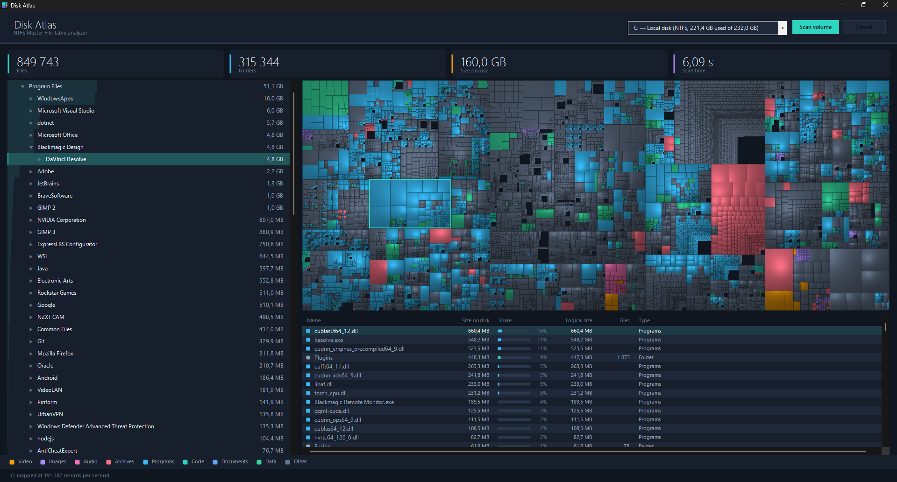

# Disk Atlas

Windows disk space analyzer that maps an entire NTFS volume in seconds by parsing the Master File Table directly instead of walking directories.



A 232 GB system drive holding 849,619 files in 315,366 folders, mapped in **5.7 seconds** — about 204,000 records a second.

## Why it is fast

A conventional folder scan asks the file system about one directory at a time, which costs a seek for every folder on the volume. Disk Atlas reads the `$MFT` instead — the table NTFS keeps of every file on the volume — as one mostly contiguous stream, and rebuilds the directory tree from the parent references it finds there.

Getting that right means handling a few things the file system normally hides:

- **Update sequence fixups.** NTFS overwrites the last two bytes of every sector in a record with a sequence number so torn writes can be detected. The real bytes live in the update sequence array and have to be put back before anything in the record can be trusted.
- **Run lists.** Non resident attributes describe their extents as chained runs where each offset is signed and relative to the previous one. This is also how the `$MFT` describes its own location.
- **Sizes that are not the obvious ones.** Compressed and sparse files occupy less on disk than their logical size, resident files live inside their own record and occupy no clusters at all, and a file with several hard links appears once in the table, so its data is counted once.

## The map

Every file is a rectangle sized by what it occupies and coloured by what it is. The layout is squarified, so rectangles stay close to square and their areas remain comparable by eye. The relief is a cushion surface: each nesting level adds a parabolic ridge, and the result is lit by a fixed light, which is what turns a flat mosaic into something you can read depth from.

Pointing at a rectangle names the file, clicking one selects its folder everywhere else in the window, which is the outlined block in the screenshot above.

The folder tree shows the largest subfolders of each level and summarises the rest, because an owner drawn tree costs about seven tenths of a millisecond per row and a folder like `WinSxS` holds twenty thousand of them. The list underneath is virtual, so it holds every child and opens instantly whatever the count.

## Acting on what you find

Right clicking a folder in the tree, or a row in the list, offers to show it in Explorer. The list also offers to delete.

Deleting goes through the shell with the undo flag set, so the item lands in the Recycle Bin and can be restored from there. The application asks first, naming the path, the size and, for a folder, how many files go with it. Windows still warns separately when something is too large to recycle and would be destroyed instead.

Afterwards the model is corrected rather than left stale: the item is taken out of the tree, its size and file count are subtracted from every folder above it, and the map, the totals and the list are redrawn.

## Status

- [x] NTFS boot sector, `$MFT` run list and FILE record parsing
- [x] Directory tree rebuilt from parent references, with sizes rolled up
- [x] Folder tree and contents browser, sorted largest first
- [x] Cushion treemap, coloured by file type, with hover and selection
- [x] Show in Explorer, and delete to the Recycle Bin

## Building

Needs the .NET 9 SDK. Visual Studio 2022 17.8 or newer can open `DiskAtlas.sln` directly; the form has a normal designer file, so it opens in the Windows Forms designer.

```
dotnet build DiskAtlas.sln
dotnet run --project src/DiskAtlas
```

## Release build

The release artifact is a single self contained executable that runs without a .NET installation. The settings live in a publish profile, so Visual Studio and the command line produce the same file:

```
dotnet publish src/DiskAtlas/DiskAtlas.csproj -p:PublishProfile=win-x64-single-file
```

The result is `publish/DiskAtlas.exe`, around 48 MB. Debug symbols are left out, so the folder holds that one file and nothing else.

## Tests

The parsers are checked against synthetic NTFS structures, including a record whose
fixups are deliberately broken, and the treemap is checked for coverage and for areas
that match the sizes they stand for:

```
dotnet run --project tests/DiskAtlas.Tests
```

## Administrator rights

Reading the Master File Table needs a raw volume handle, which Windows only grants to an elevated process, so the manifest asks for elevation at startup.

This means **Visual Studio has to run as administrator to debug the project**. Running the assembly directly with `dotnet DiskAtlas.dll` bypasses the manifest and starts unelevated, which is useful for working on the interface without a UAC prompt.

## Layout

```
src/DiskAtlas/Ntfs/        boot sector, run lists, FILE records, table walker
src/DiskAtlas/Scanning/    tree building and the scan entry point
src/DiskAtlas/Model/       volumes, raw records, the finished tree
src/DiskAtlas/Rendering/   treemap layout, cushion shading, file type colours
src/DiskAtlas/Controls/    the treemap, legend and stat controls
src/DiskAtlas/Native/      the Win32 calls needed for raw volume access
tests/DiskAtlas.Tests/     parser checks against synthetic structures
```

## License

MIT, see [LICENSE](LICENSE).
